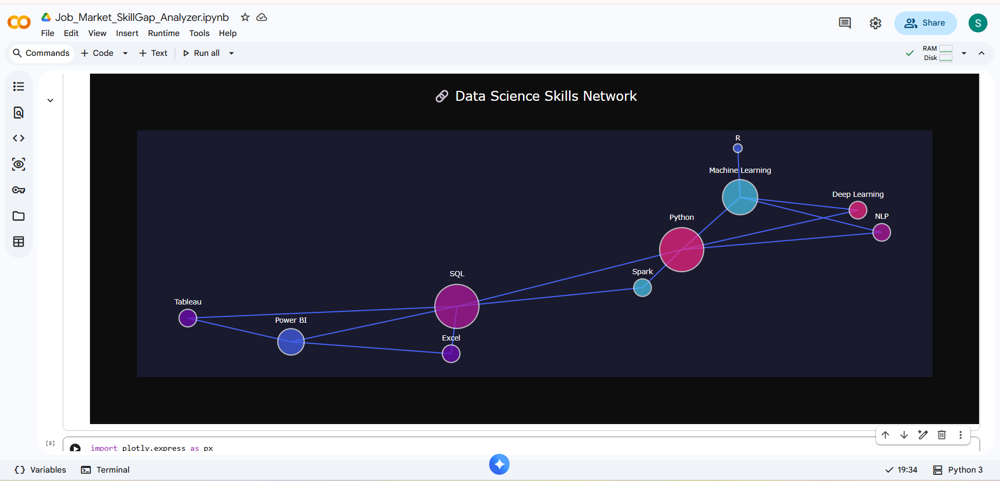
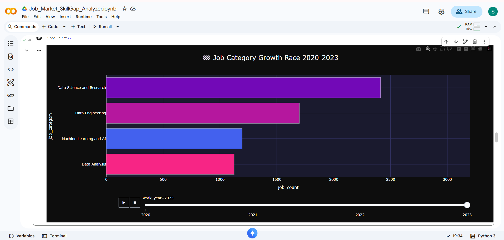
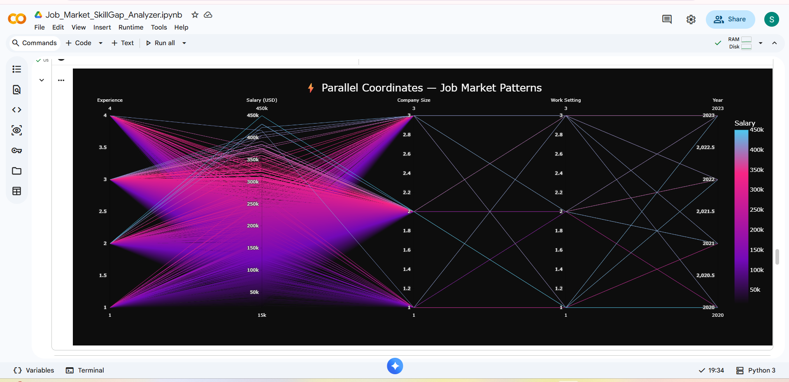
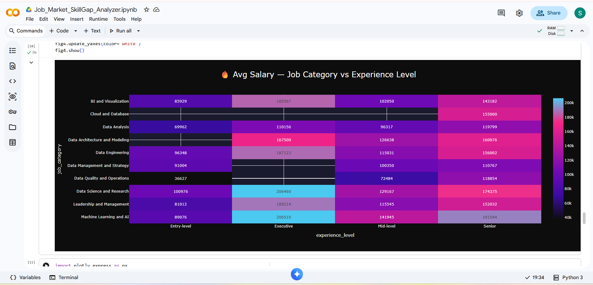
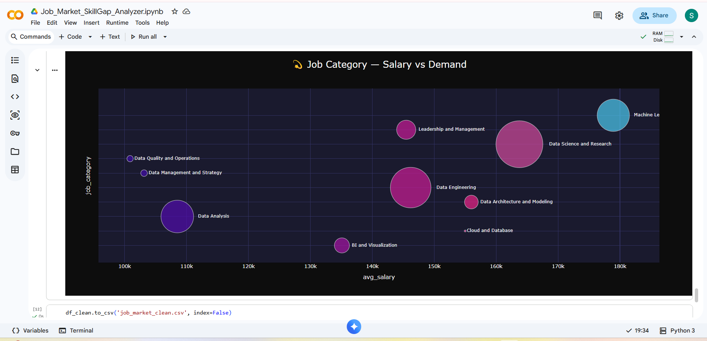

# Job Market & Salary Analysis

Data analysis project exploring salary trends across job categories, experience levels, and roles in the data field, using Python for exploratory analysis and Tableau for interactive visualization.

## Tools Used
- Python (Pandas, SQLite, Plotly, NetworkX)
- Tableau Public
- Google Colab

## Live Dashboard
🔗 [View Interactive Tableau Dashboard](https://public.tableau.com/app/profile/srushti.thakre4507/viz/Job_Market_Analyzer_/Dashboard1?publish=yes)

## Key Insights
- **Machine Learning & AI roles** command the highest average salaries across all job categories.
- **Salary progression** shows strong growth by experience level, with Executive roles earning significantly more than Entry-level.
- **Top Roles:** Analytics Engineering Manager and Data Science Tech Lead are among the top highest-paying job titles in the dataset.

## Visualizations

### Tableau Interactive Dashboard
- KPI summary cards (average salary, total categories, highest salary)
- Salary breakdown by category and experience level
- Top 10 highest-paying job titles
- Interactive Work Setting filter (Remote/Hybrid/In-person)

---

### Python / Plotly Visualizations (Google Colab)

#### 1. Skills Network Graph
*Relationships between in-demand data skills*

#### 2. Animated Bar Race
*Job category growth from 2020-2023*

#### 3. Parallel Coordinates
*Multi-dimensional job market patterns*

#### 4. Salary Heatmap
*Average salary by category and experience level*

#### 5. Bubble Chart
*Salary vs demand by job category*

---

## Dataset
Job postings dataset covering data science, ML, and analytics roles (2020-2023), sourced from Kaggle.
