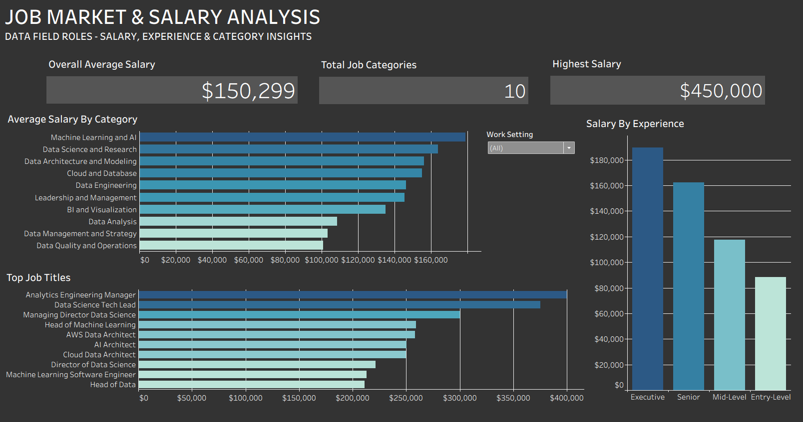

# Job Market & Salary Analysis

Data analysis project exploring salary trends across job categories, 
experience levels, and roles in the data field, using Python for 
exploratory analysis and Tableau for interactive visualization.

## Tools Used
- Python (Pandas, SQLite, Plotly, NetworkX)
- Tableau Public
- Google Colab

## Live Dashboard
[View Interactive Tableau Dashboard]([YOUR_TABLEAU_PUBLIC_LINK_HERE](https://public.tableau.com/app/profile/srushti.thakre4507/viz/Job_Market_Analyzer_/Dashboard1?publish=yes)

## Key Insights
- Machine Learning and AI roles command the highest average salaries 
  across all job categories
- Salary shows strong progression by experience level, with Executive 
  roles earning significantly more than Entry-level
- Analytics Engineering Manager and Data Science Tech Lead are among 
  the top 10 highest-paying job titles in the dataset

## Visualizations

### Python/Plotly (Google Colab)
- Skills Network Graph — relationships between in-demand data skills
- Animated Bar Race — job category growth from 2020-2023
- Parallel Coordinates — multi-dimensional job market patterns
- Salary Heatmap — average salary by category and experience level
- Bubble Chart — salary vs demand by job category

### Tableau Dashboard
- KPI summary cards (average salary, total categories, highest salary)
- Salary breakdown by category and experience level
- Top 10 highest-paying job titles
- Interactive Work Setting filter (Remote/Hybrid/In-person)

## Dataset
Job postings dataset covering data science, ML, and analytics roles 
(2020-2023), sourced from Kaggle.
